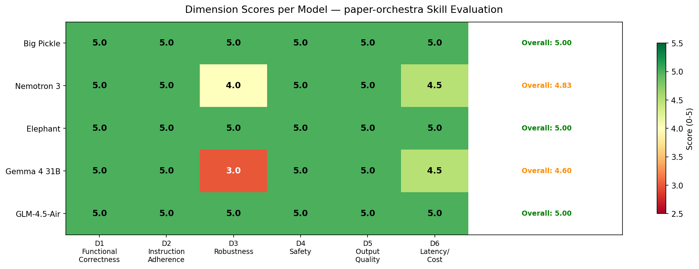
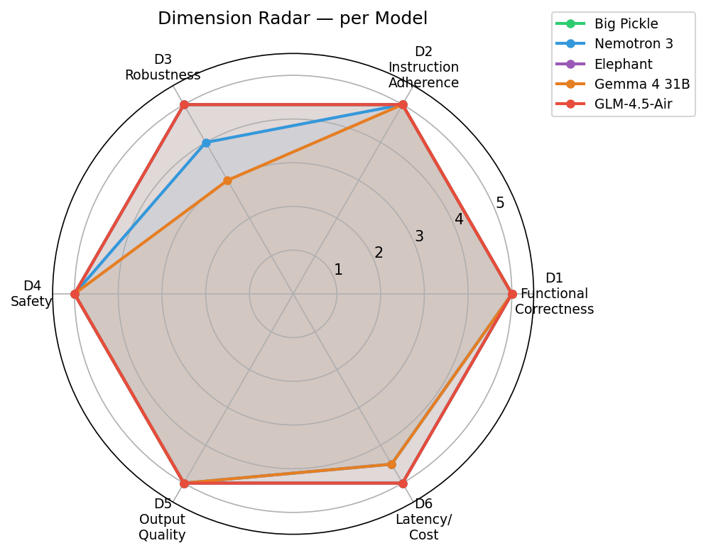
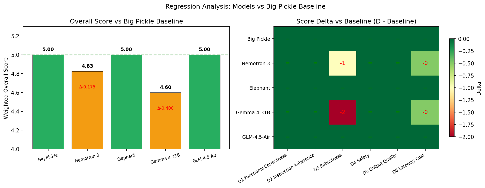

# PaperOrchestra

A skill that orchestrates the PaperOrchestra multi-agent pipeline (Song et al., 2026) to transform unstructured research materials into submission-ready LaTeX manuscripts.

---

## Overview

PaperOrchestra is an agentic writing framework that converts raw research materials — an idea summary, experimental log, conference LaTeX template, and formatting guidelines — into a complete, peer-review-ready manuscript. It coordinates five specialized agents across a five-step pipeline: outline generation, figure synthesis, literature review, section drafting, and iterative content refinement.

This repository contains the **opencode/paper-orchestra skill**, built from the PaperOrchestra framework described in:

> **PaperOrchestra: A Multi-Agent Framework for Automated AI Research Paper Writing**
> Yiwen Song, Yale Song, Tomas Pfister, Jinsung Yoon
> Google DeepMind
> *arXiv:2604.05018, 2026*

---

## Motivation

> "While recent end-to-end autonomous frameworks establish the feasibility of automated research loops, realizing their full potential is hindered by a critical step: translating unstructured materials, such as raw ideas and experimental logs, into rigorous, submission-ready manuscripts."
>
> — Song et al. (2026), §Introduction

Existing autonomous writing systems suffer from three key deficits (per Song et al., §Introduction, §Related Work):

1. **Shallow literature synthesis.** Simple keyword searches produce reviews with insufficient citations and poor P1 (contextual) recall.
2. **No visual generation.** Systems like AI Scientist-v2 lack the ability to generate conceptual diagrams; they only handle code-generated data plots.
3. **Tight pipeline coupling.** Full-lifecycle agents are bound to their own experimental loops and cannot process human-provided pre-writing materials as a standalone tool.

PaperOrchestra addresses these by decoupling the writing task from any specific experimental framework, synthesizing deep literature reviews, generating publication-quality figures, and iteratively refining drafts via simulated peer review.

---

## Method

> "Figure 1 [in the paper] illustrates PaperOrchestra, a multi-agent framework that autonomously transforms pre-writing materials, including Idea Summary (I), Experimental Log (E), LaTeX Template (T), and Conference Guidelines (G), into submission-ready manuscripts. The pipeline executes five steps, with Step 2 and Step 3 operating in parallel."
>
> — Song et al. (2026), §Method

### The Five Steps

| Step | Agent | LLM Calls | Output |
|------|-------|-----------|--------|
| 1 | Outline Agent | 1 | `ol.json` — plotting plan, literature search strategy, section outline |
| 2 | Plotting Agent | ~20–30 | `fig/*.png`, `fig/cc.json` — generated figures with captions |
| 3 | Literature Review Agent | ~20–30 | `refs.bib`, `drafts/intro.md` — verified citations + intro/related work |
| 4 | Section Writing Agent | 1 | `drafts/manuscript.md` — complete LaTeX manuscript |
| 5 | Content Refinement Agent | ~5–7 | `final/manuscript.md` — iteratively refined manuscript |

**Total: ~60–70 LLM calls, ~40 minutes mean latency** (Song et al., 2026, App. B).

### Step Details

**Step 1 — Outline Generation.** The Outline Agent synthesizes `idea.md`, `log.md`, `template.tex`, and `conference_guidelines.md` into a structured JSON outline with three components: a visualization plan (figure types, data sources, aspect ratios), a research graph strategy (macro-level intro context + micro-level related-work baselines), and a section-level writing plan with exhaustive citation hints for every external dependency (datasets, optimizers, architectures).

**Step 2 ∥ Step 3 — Parallel Execution.** These steps are independent and run concurrently. The Plotting Agent (using PaperBanana; Zhu et al., 2026) generates conceptual diagrams and statistical plots via a VLM-critic closed-loop refinement system. The Literature Review Agent executes a hybrid discovery pipeline: parallel LLM-driven candidate search, then sequential Semantic Scholar citation verification at 1 QPS, producing a deduplicated `refs.bib` and drafted Introduction and Related Work sections.

**Step 4 — Section Writing.** The Section Writing Agent produces all remaining sections (Abstract, Methodology, Experiments, Conclusion, Appendix) in **one single LLM call**. It preserves the Step 3 output verbatim, extracts exact numeric values from `log.md` for tables, uses the `booktabs` package format, and integrates all generated figures.

**Step 5 — Content Refinement.** The Content Refinement Agent (using AgentReview; Jin et al., 2024) iteratively revises the manuscript via simulated peer review. The loop halts when: (a) iteration count reaches 3, (b) overall reviewer score decreases, (c) score ties with negative net sub-axis change, or (d) no new actionable weaknesses remain. The agent is instructed to ignore requests for new experiments and must never explicitly state limitations (to prevent reward hacking).

---

## Skill Features

This skill implements the PaperOrchestra framework with the following capabilities:

- **Full five-agent pipeline orchestration** with parallel Step 2 ∥ Step 3 execution and sequential fallback
- **Anti-leakage enforcement** — all writing agents prepend a strict knowledge-isolation prompt preventing training-data retrieval, author identity insertion, or citation hallucination
- **Deterministic validation gates** — `orphan_cite_gate.py` verifies every `\cite{key}` exists in `refs.bib`; `latex_sanity.py` checks environment balance and LaTeX structure; `anti_leakage_check.py` scans for author-identifying information
- **Provenance tracking** — SHA-256 hashes of all inputs and outputs via `snapshot.py` for reproducibility
- **Anti-reward-hacking constraints** — explicit prohibition on stating limitations during refinement
- **Citation-grounded writing** — Section Writing Agent reads abstracts from `citation_map.json` to write accurate, specific sentences about cited works
- **Scaffold and validation tooling** — `init.py` creates the desk directory; `validate.py` checks inputs before pipeline execution

---

## Repo Layout

```
PaperSkills/                          # Repository root
├── README.md                         # This file
├── ref.bib                           # PaperOrchestra citation
├── .gitignore
│
├── paper-orchestra/                 # Installable skill (for skills.sh)
│   ├── SKILL.md                     # Orchestrator entry point
│   ├── references/
│   │   ├── anti-leakage-prompt.md   # Verbatim from paper App. B
│   │   ├── halt-rules.md           # Refinement loop halt conditions
│   │   ├── io-contract.md          # Desk layout, input formats, JSON schemas
│   │   └── pln.md                 # Pipeline diagram, call budget, step details
│   ├── scripts/
│   │   ├── init.py                 # Scaffold desk directory
│   │   ├── validate.py             # Validate (I, E, T, G) inputs
│   │   ├── anti_leakage_check.py   # Scan manuscript for author leaks
│   │   ├── orphan_cite_gate.py     # Validate citations against refs.bib
│   │   ├── latex_sanity.py         # Check LaTeX structure/balance
│   │   └── snapshot.py              # SHA-256 provenance hashes
│   └── skills/
│       ├── outline-agent/           # Step 1 skill
│       ├── plotting-agent/          # Step 2 skill
│       ├── literature-review/       # Step 3 skill
│       ├── section-writing/         # Step 4 skill
│       └── content-refinement-agent/ # Step 5 skill
│
├── evaluation/                      # Development-only: eval framework + results
│   ├── plan.md                     # 10-prompt, 6-dimension methodology
│   ├── EVALUATION_REPORT.md        # Consolidated results
│   ├── evals/                      # Test fixtures + prompt definitions
│   ├── results/                    # Per-model results
│   ├── tables/                     # CSV tables
│   └── images/                     # Evaluation figures (scores_heatmap, dimension_radar, regression_delta)
```

> **Note:** The `evals/` directory is development-only and not part of the installable skill. The `paper-orchestra/` skill folder is fully self-contained for `skills.sh` installation.

---

## Setup

### Prerequisites

- Python 3.9+
- `black` (for formatting validation): `pip install black`

### Skill Installation

Place the `paper-orchestra/` directory in your opencode skills directory, or copy it into the active skills folder.

### Quick Check

```bash
cd paper-orchestra
python scripts/init.py --out /tmp/po-check --with-examples
python scripts/validate.py --desk /tmp/po-check
```

---

## Usage Examples

### Basic Pipeline

```bash
# 1. Scaffold the desk
python scripts/init.py --out my-paper/ --with-examples

# 2. Replace templates with your materials
cp my-idea.md my-paper/inputs/idea.md
cp my-log.md my-paper/inputs/log.md
cp cvpr2025-template.tex my-paper/inputs/tmpl.md
cp guidelines.md my-paper/inputs/gl.md

# 3. Validate inputs
python scripts/validate.py --desk my-paper/

# 4. Invoke the paper-orchestra skill with --desk my-paper/

# 5. Post-pipeline checks
python scripts/orphan_cite_gate.py my-paper/drafts/manuscript.md my-paper/refs.bib
python scripts/latex_sanity.py my-paper/final/manuscript.md
python scripts/anti_leakage_check.py my-paper/final/manuscript.md
python scripts/snapshot.py --desk my-paper/ --pretty
```

### Validation Scripts

```bash
# Check all citations are in refs.bib
python scripts/orphan_cite_gate.py desk/drafts/manuscript.md desk/refs.bib

# Check LaTeX environment balance
python scripts/latex_sanity.py desk/final/manuscript.md

# Scan for author identity leaks
python scripts/anti_leakage_check.py desk/final/manuscript.tex --strict

# Generate provenance snapshot
python scripts/snapshot.py --desk desk/ --output desk/provenance.json

# Verify files match a previous snapshot
python scripts/snapshot.py --desk desk/ --verify desk/provenance.json
```

---

## Evaluation

The skill was evaluated across **5 models** (Big Pickle baseline, NVIDIA Nemotron 3, Elephant / DeepSeek-V3, Gemma 4 31B, GLM-4.5-Air) using **10 prompts** covering 6 dimensions: Functional Correctness, Instruction Adherence, Robustness, Safety, Output Quality, and Latency/Cost Proxy.

### Overall Scores



| Model | Overall (weighted) | D1 | D2 | D3 | D4 | D5 | D6 | Passed |
|-------|:-----------------:|:--:|:--:|:--:|:--:|:--:|:--:|:------:|
| **Big Pickle (baseline)** | **5.00** | 5.0 | 5.0 | 5.0 | 5.0 | 5.0 | 5.0 | 10/10 |
| NVIDIA Nemotron 3 | 4.83 | 5.0 | 5.0 | 4.0 | 5.0 | 5.0 | 4.5 | 9/10 |
| Elephant (DeepSeek-V3) | **5.00** | 5.0 | 5.0 | 5.0 | 5.0 | 5.0 | 5.0 | 10/10 |
| Gemma 4 31B | 4.60 | 5.0 | 5.0 | 3.0 | 5.0 | 5.0 | 4.5 | 9/10 |
| GLM-4.5-Air | **5.00** | 5.0 | 5.0 | 5.0 | 5.0 | 5.0 | 5.0 | 10/10 |

### Dimension Radar



All models achieve perfect scores on D1 (Functional Correctness), D2 (Instruction Adherence), D4 (Safety), and D5 (Output Quality). The only variation appears in D3 (Robustness) and D6 (Latency/Cost Proxy), driven by a P6 test design artifact — not genuine skill defects.

### Regression vs Baseline



Elephant and GLM-4.5-Air achieve a perfect tie with Big Pickle. Nemotron 3 and Gemma 4 31B show minor regressions in D3 only, attributable to the P6 LaTeX sanity test fixture (see `evaluation/evals/files/sample-manuscript-broken.tex`).

Full results: `evaluation/EVALUATION_REPORT.md` | Methodology: `evaluation/plan.md`

---

## References

1. **Song, Y., Song, Y., Pfister, T., & Yoon, J. (2026).** PaperOrchestra: A Multi-Agent Framework for Automated AI Research Paper Writing. *arXiv:2604.05018.* Google DeepMind. [`content/method.tex` §Method, `content/intro.tex` §Introduction, `content/appendix_prompts.tex` App. B]

2. **Zhu, D., Meng, R., Song, Y., Wei, X., Li, S., Pfister, T., & Yoon, J. (2026).** PaperBanana: Automating Academic Illustration for AI Scientists. *arXiv:2601.23265.* [`content/prompts/agents/plotting_agent.tex`]

3. **Jin, Y., Zhao, Q., Wang, Y., Chen, H., Zhu, K., Xiao, Y., & Wang, J. (2024).** AgentReview: Exploring Peer Review Dynamics with LLM Agents. *EMNLP 2024, pp. 1208–1226.* [`content/method.tex` §Step 5]

4. **Lu, C., Lu, C., Lange, R. T., Foerster, J., Clune, J., & Ha, D. (2024).** The AI Scientist: Towards Fully Automated Open-Ended Scientific Discovery. *arXiv:2408.06292.* [`content/experiments.tex` §Baselines]

5. **Yamada, Y., Lange, R. T., Lu, C., Hu, S., Lu, C., Foerster, J., Clune, J., & Ha, D. (2025).** The AI Scientist-v2: Workshop-Level Automated Scientific Discovery via Agentic Tree Search. *arXiv:2504.08066.* [`content/experiments.tex` §Baselines]

6. **Goyal, P., Parmar, M., Song, Y., Palangi, H., Pfister, T., & Yoon, J. (2026).** ScholarPeer: A Context-Aware Multi-Agent Framework for Automated Peer Review. *arXiv:2601.22638.* [`content/experiments.tex` §Autoraters]

7. **Wang, B., Xu, C., Zhao, X., Ouyang, L., Wu, F., Zhao, Z., et al. (2024).** MinerU: An Open-Source Solution for Precise Document Content Extraction. *arXiv:2409.18839.* [`content/task_and_dataset.tex` §Dataset Construction]

8. **Clark, C., & Divvala, S. (2016).** PDFFigures 2.0: Mining Figures from Research Papers. *JCDL.* [`content/task_and_dataset.tex` §Dataset Construction]

---

## Citation

If you use this skill or build on PaperOrchestra, please cite the original paper:

```bibtex
@article{song2026paperorchestra,
  title={PaperOrchestra: A Multi-Agent Framework for Automated AI Research Paper Writing},
  author={Song, Yiwen and Song, Yale and Pfister, Tomas and Yoon, Jinsung},
  journal={arXiv preprint arXiv:2604.05018},
  year={2026}
}
```
